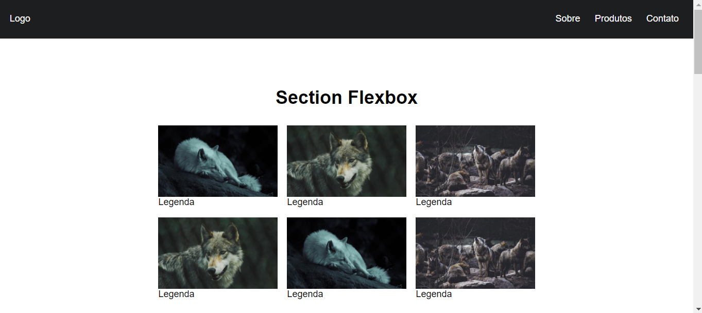
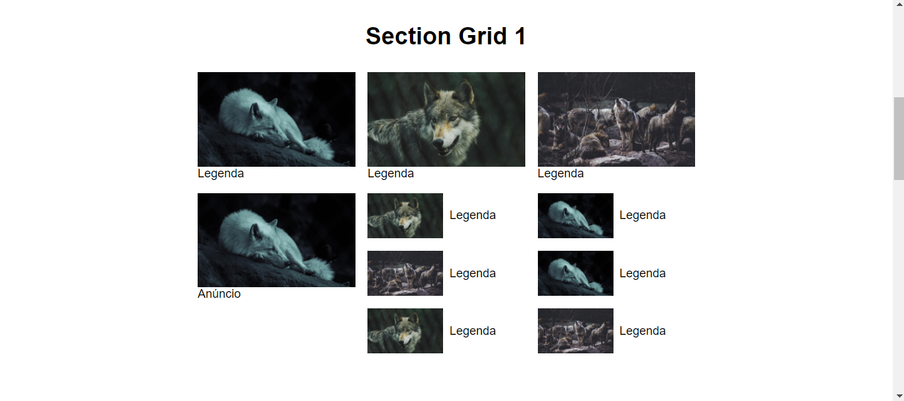
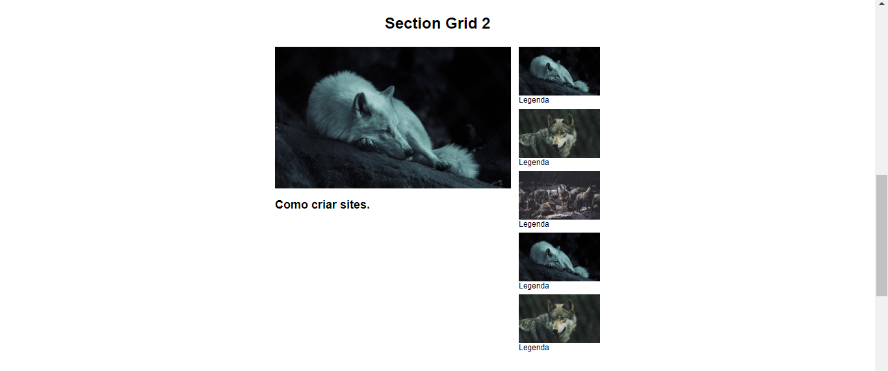
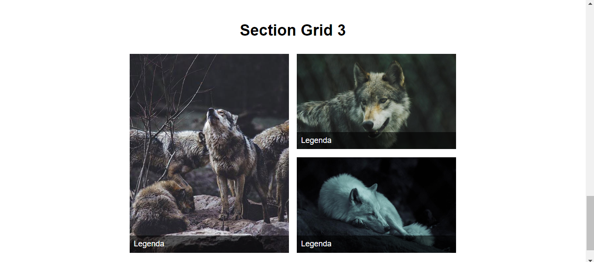

# ORIGAMID
☑️O SITE CONSISTE EM UMA PÁGINA WEB CONTENDO ALGUNS EXEMPLOS DE LAYOUT UTILIZANDO GRID E FLEXBOX.

  
  
  
  

## DESCRIÇÃO:
O aplicativo é uma página da web que demonstra o uso de CSS Grid e Flexbox para criar layouts responsivos. Ele apresenta diferentes seções, cada uma utilizando técnicas específicas de layout para organizar elementos na página. Isso inclui uma seção que utiliza Flexbox para criar uma disposição flexível de imagens e legendas, várias seções que utilizam CSS Grid para organizar imagens e legendas em grades definidas, e uma seção que combina Grid e Flexbox para criar um layout mais complexo com vídeo e barra lateral. 

## NÃO SABE?
- Entendemos que para manipular arquivos em `HTML`, `CSS` e outras linguagens relacionadas, é necessário possuir conhecimento nessas áreas. Para auxiliar nesse aprendizado, oferecemos cursos gratuitos disponíveis:
* [CURSO DE HTML E CSS](https://github.com/VILHALVA/CURSO-DE-HTML-E-CSS)
* [CURSO DE JAVASCRIPT](https://github.com/VILHALVA/CURSO-DE-JAVASCRIPT)
* [CONFIRA MAIS CURSOS](https://github.com/VILHALVA?tab=repositories&q=+topic:CURSO)

## CREDITOS:
- [PROJETO CRIADO PELO "brunocesaromax"](https://github.com/brunocesaromax/css-grid-layout-flexbox)
- [VIDEO DO PROJETO](https://www.youtube.com/watch?v=x-4z_u8LcGc)
- [PROJETO EDITADO PELO VILHALVA](https://github.com/VILHALVA)
